# Polyhedron Segmentation Workflow

This Mermaid diagram shows the complete workflow when running:

```bash
python polyhedron_segmentation.py --input /Users/fammasmaz/Downloads/test_inpaint/railway_track_0.3x1.2x5.0_123.vti --output /Users/fammasmaz/Downloads/test_big_clean.json --no-paraview-multiblock --decimation-ratio 0.95 --smoothing-iterations 15 --erosion-iterations 0 --min-polyhedron-size 1 --remove-boundary-polyhedrons --max-voxel-aspect-ratio 0.0 --fast-mesh-extraction --use-chunking --fast-chunk-merge --stream-batch-size 0 --num-workers 8 --batch-mesh-size 0 --force-cpu --num-export-workers 8 --export-batch-size 200 --fast-paraview-export
```

```mermaid
flowchart TD
    A[Start: polyhedron_segmentation.py] --> B[Parse Command Line Arguments]
    
    B --> C{force-cpu flag?}
    C -->|Yes| D[Set GPU Backend = CPU]
    C -->|No| E[Auto-detect GPU Backend]
    D --> F[Initialize PolyhedronSegmentation]
    E --> F
    
    F --> G[Load VTI Input File]
    G --> H[railway_track_0.3x1.2x5.0_123.vti]
    H --> I[Convert VTI to Numpy Array]
    
    I --> J{use-chunking flag?}
    J -->|Yes| K[**CHUNKED PROCESSING PATH**]
    J -->|No| L[**STANDARD PROCESSING PATH**]
    
    %% CHUNKED PROCESSING PATH
    K --> M[Create Overlapping Chunks<br/>512x512x512 with 32px overlap]
    M --> N[Process Chunks in Parallel<br/>max workers = auto-detect]
    
    N --> O[For Each Chunk:<br/>Preprocessing]
    O --> P[Binary Threshold: 0.5<br/>Gaussian Sigma: 0.5<br/>Remove Small Objects: 10]
    
    P --> Q[Segmentation Method: watershed<br/>erosion-iterations: 0<br/>min-distance: 7]
    Q --> R[Watershed with Distance Transform<br/>Gaussian Smooth DT Sigma: 1.0<br/>Peak Local Max Footprint: 3x3x3]
    
    R --> S[Label Connected Components]
    S --> T[Filter by min-polyhedron-size: 1]
    
    T --> U{fast-chunk-merge?}
    U -->|Yes| V[Ultra-Fast Chunk Merging<br/>Vectorized overlap resolution]
    U -->|No| W[Detailed Chunk Merging]
    V --> X[Merged Label Grid]
    W --> X
    
    %% MESH EXTRACTION PHASE
    X --> Y[**MESH EXTRACTION PHASE**]
    Y --> Z{stream-batch-size > 0?}
    Z -->|No - equals 0| A1[Process All Labels at Once]
    Z -->|Yes| B1[Stream Process in Batches]
    A1 --> C1[Extract Polyhedrons]
    B1 --> C1
    
    C1 --> D1{fast-mesh-extraction?}
    D1 -->|Yes| E1[Fast Mesh Extraction Path]
    D1 -->|No| F1[Standard Mesh Extraction]
    
    E1 --> G1{batch-mesh-size > 0?}
    G1 -->|No - equals 0| H1[Process All in Single Batch]
    G1 -->|Yes| I1[Process in Batches]
    H1 --> J1[Extract Meshes with Optimizations]
    I1 --> J1
    
    F1 --> J1
    J1 --> K1[For Each Polyhedron:<br/>- Marching Cubes<br/>- Smoothing: 15 iterations<br/>- Decimation: 0.95 ratio]
    
    K1 --> L1[Coordinate Validation<br/>max threshold: 1e4]
    L1 --> M1{remove-boundary-polyhedrons?}
    M1 -->|Yes| N1[Remove Boundary Touching]
    M1 -->|No| O1[Keep All Polyhedrons]
    N1 --> P1[Voxel Aspect Ratio Filter]
    O1 --> P1
    P1 --> Q1{max-voxel-aspect-ratio > 0?}
    Q1 -->|No - equals 0.0| R1[Skip Aspect Ratio Filtering]
    Q1 -->|Yes| S1[Filter by Aspect Ratio]
    R1 --> T1[Mesh Range Outlier Filter]
    S1 --> T1
    
    T1 --> U1[Calculate Centroids & Bounding Boxes]
    U1 --> V1[Convert to JSON Format]
    V1 --> W1[Save to: test_big_clean.json]
    
    W1 --> X1{paraview-export enabled?}
    X1 -->|Yes| Y1[**PARAVIEW EXPORT**]
    X1 -->|No| Z1[End]
    
    Y1 --> A2{fast-paraview-export?}
    A2 -->|Yes| B2[Fast Parallel Export<br/>Workers: 8<br/>Batch Size: 200]
    A2 -->|No| C2[Standard Export]
    
    B2 --> D2{paraview-multiblock?}
    C2 --> D2
    D2 -->|No| E2[Export as Single .vtu file]
    D2 -->|Yes| F2[Export as .vtm MultiBlock]
    
    E2 --> G2[Include Z-depth data]
    F2 --> G2
    G2 --> Z1[End: Output Files Created]
    
    %% STANDARD PROCESSING PATH (if no chunking)
    L --> H2[Preprocess Entire Grid]
    H2 --> I2[Segment Entire Grid]
    I2 --> Y
    
    %% Styling
    classDef inputFile fill:#e1f5fe,stroke:#01579b
    classDef processing fill:#f3e5f5,stroke:#4a148c
    classDef chunking fill:#e8f5e8,stroke:#1b5e20
    classDef meshExtraction fill:#fff3e0,stroke:#e65100
    classDef output fill:#e0f2f1,stroke:#004d40
    classDef decision fill:#fce4ec,stroke:#880e4f
    
    class H,W1,Z1 inputFile
    class M,N,O,P,Q,R,S,T,V,W,X processing
    class K,U,Z,A1,B1 chunking
    class Y,C1,D1,E1,J1,K1,L1,T1,U1,V1 meshExtraction
    class Y1,B2,E2,F2,G2 output
    class C,J,U,Z,G1,M1,Q1,X1,A2,D2 decision
```



## Key Workflow Points for Your Command:

### Input Parameters Used:
- **Input**: `railway_track_0.3x1.2x5.0_123.vti`
- **Output**: `test_big_clean.json`
- **Force CPU**: True (disables GPU acceleration)
- **Chunking**: Enabled with fast merge
- **Decimation**: 95% reduction (0.95 ratio)
- **Smoothing**: 15 iterations
- **Erosion**: 0 iterations (disabled)
- **Min Size**: 1 voxel (keeps very small polyhedrons)
- **Boundary Removal**: Enabled
- **Aspect Ratio Filter**: Disabled (0.0)
- **Fast Mesh Extraction**: Enabled
- **Stream Batch Size**: 0 (process all at once)
- **Workers**: 8 cores
- **Batch Mesh Size**: 0 (single batch)
- **Paraview Export**: Fast export with 8 workers, 200 batch size

### Processing Flow:
1. **Initialization**: CPU-only processing, no GPU acceleration
2. **Input Loading**: VTI file loaded and converted to numpy array
3. **Chunked Processing**: 512³ chunks with 32px overlap, parallel processing
4. **Segmentation**: Watershed method with distance transform
5. **Fast Merging**: Vectorized chunk merge with ultra-fast optimizations
6. **Mesh Extraction**: Single batch processing (batch_size=0) with aggressive optimizations
7. **Filtering**: Boundary removal, coordinate validation, no aspect ratio filtering
8. **Output**: JSON export + Paraview export as single .vtu file

### Performance Optimizations Applied:
- Chunked processing for memory efficiency
- Fast chunk merging algorithm
- Stream processing disabled (batch_size=0)
- Fast mesh extraction with single batch
- Parallel Paraview export
- CPU-only processing (no GPU overhead)