# Complete Process Flow: Trainer and generate_sample_images Function

## 1. Trainer Class Overview

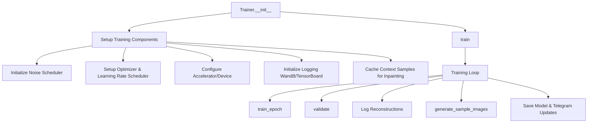

## 2. Training Process Flow

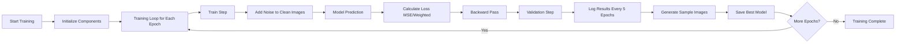

## 3. generate_sample_images Function - Complete Flow

### 3.1 Initialization Phase

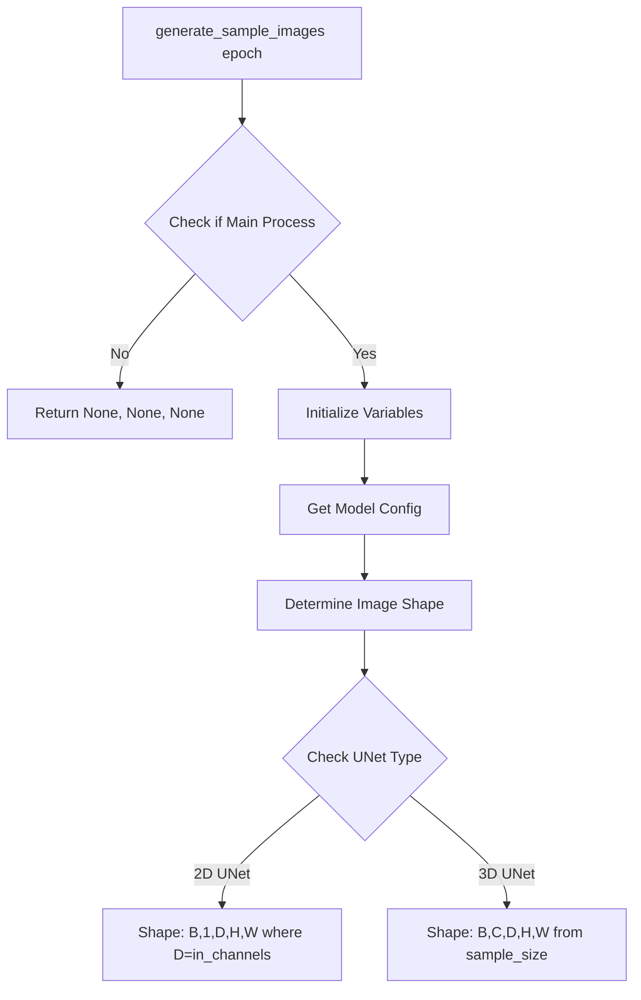

### 3.2 Context Setup for Inpainting

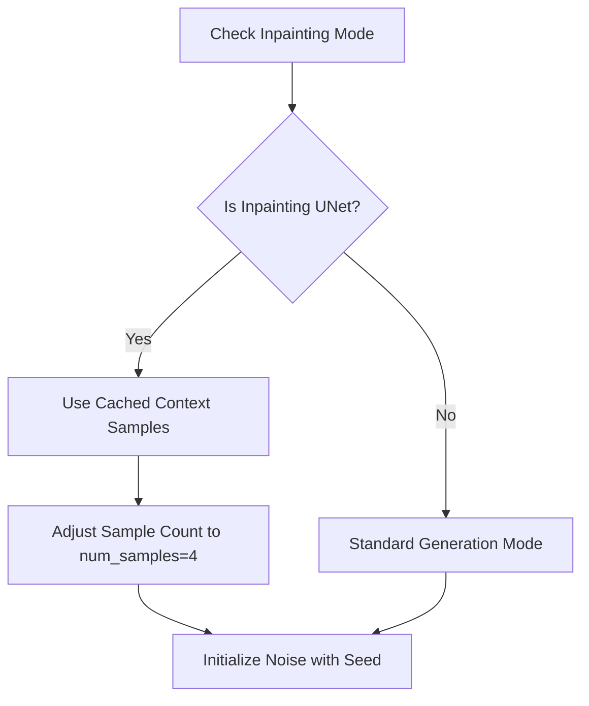

### 3.3 Sampler Configuration

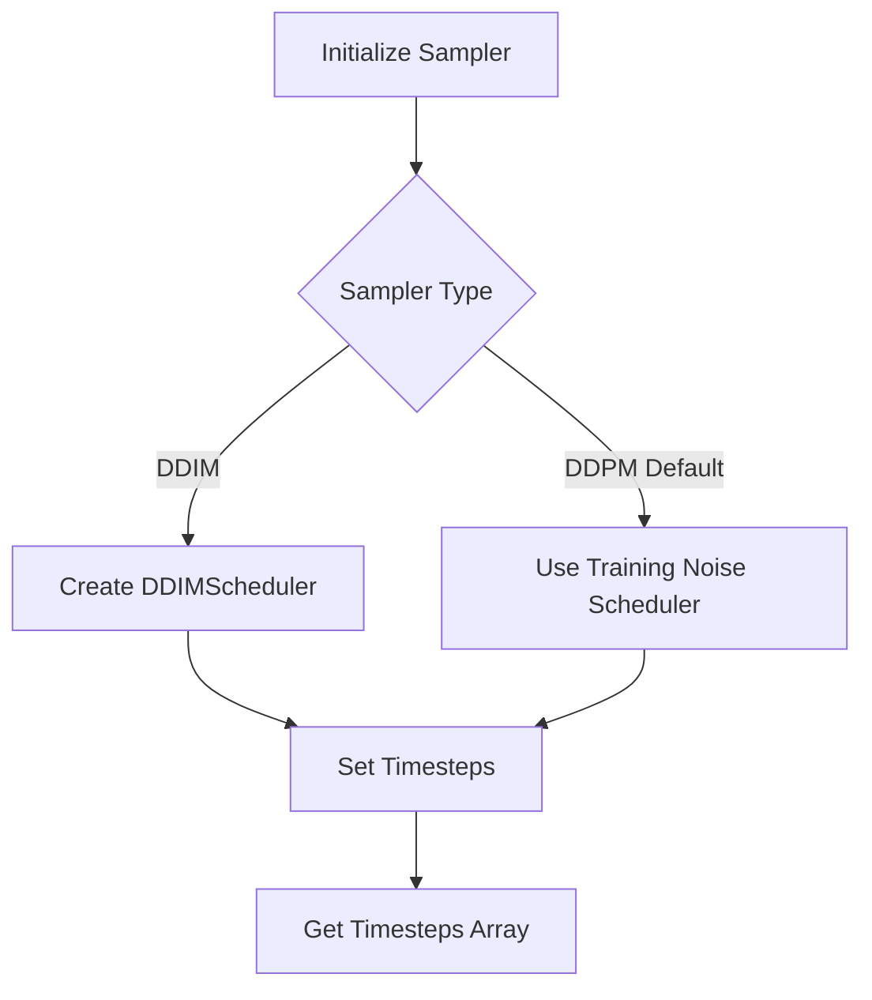

### 3.4 Main Sampling Loop

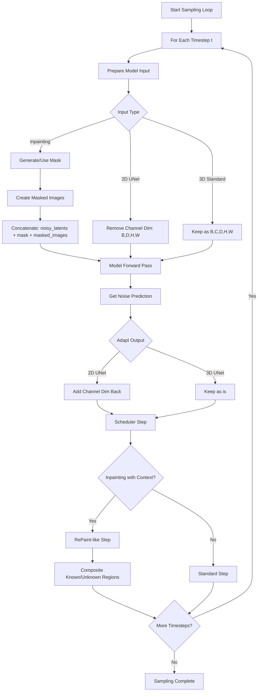

### 3.5 RePaint-like Inpainting Step (Detailed)

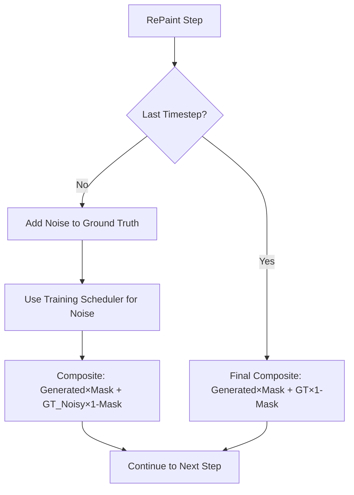

### 3.6 Post-Processing Pipeline

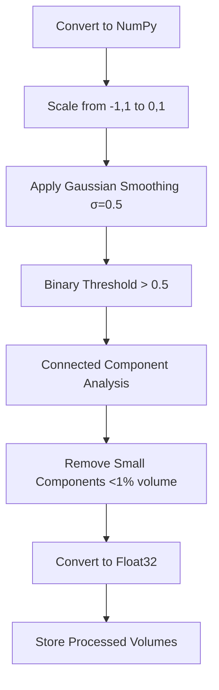

### 3.7 Visualization and Saving

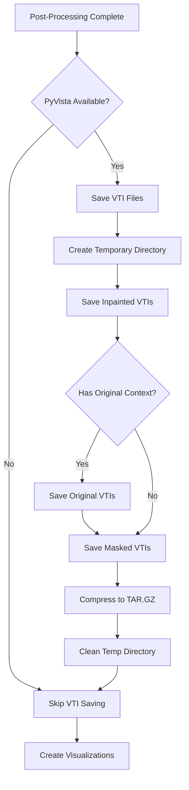

### 3.8 Visualization Creation

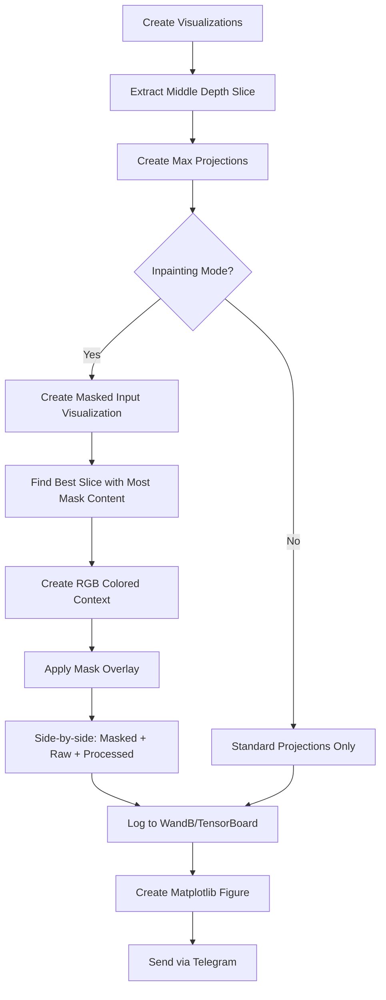

## 4. Key Data Structures and Transformations

### 4.1 Tensor Shapes Throughout Process

| Stage | 2D UNet Shape | 3D UNet Shape | Inpainting Shape |
|-------|---------------|---------------|------------------|
| Initial | `(B,1,D,H,W)` | `(B,C,D,H,W)` | `(B,C,D,H,W)` |
| Model Input | `(B,D,H,W)` | `(B,C,D,H,W)` | `(B,2C+1,D,H,W)` |
| Model Output | `(B,D,H,W)` | `(B,C,D,H,W)` | `(B,C,D,H,W)` |
| Final | `(B,1,D,H,W)` | `(B,C,D,H,W)` | `(B,C,D,H,W)` |

### 4.2 Mask Generation Types

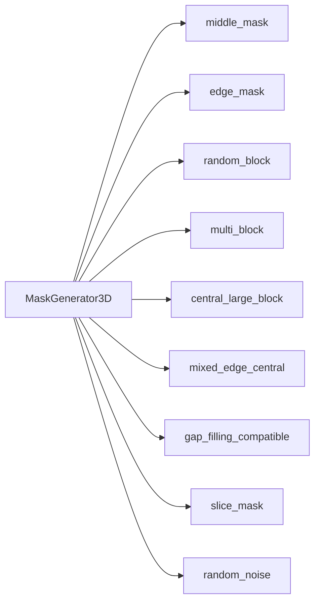

## 5. Loss Calculation Variants

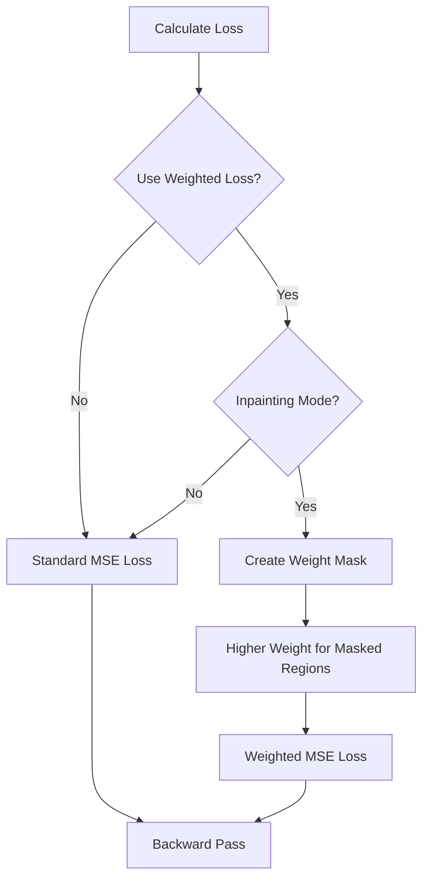

## 6. Function Return Values

The `generate_sample_images` function returns a tuple of three elements:

1. **`processed_volumes_01`**: List of processed inpainted volumes in [0,1] range
2. **`original_vti_processed`**: List of processed original context volumes (inpainting mode only)
3. **`masked_vti_processed`**: List of processed masked context volumes (inpainting mode only)

For non-inpainting modes, the last two return values are `None`.

## 7. Key Features

### 7.1 Inpainting Capabilities
- Uses cached context samples from training data
- Supports multiple mask types via `MaskGenerator3D`
- Implements RePaint-like guidance during sampling
- Creates side-by-side visualizations of input/output

### 7.2 Multi-Modal Support
- **2D UNet**: Treats depth as channels `(B,D,H,W)`
- **3D UNet**: Standard volumetric processing `(B,C,D,H,W)`
- **Inpainting UNet**: Concatenated input `[noisy, mask, masked_context]`

### 7.3 Robust Sampling
- Supports both DDPM and DDIM samplers
- Configurable number of inference steps
- Deterministic seeding for reproducibility
- GPU memory efficient processing

### 7.4 Advanced Post-Processing
- Gaussian smoothing for noise reduction
- Connected component filtering
- Binary thresholding for clean outputs
- Multiple visualization formats (slices, projections)

This comprehensive pipeline enables the trainer to generate high-quality 3D volumetric samples with support for both standard generation and sophisticated inpainting tasks.